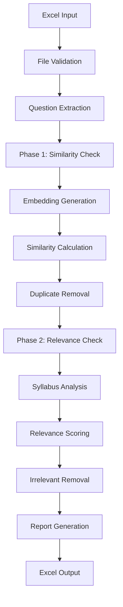

# 🛠️ Syllabus Checker - Developer Documentation

## 🏗️ **Development Environment Setup**

### **📋 Prerequisites**
- Python 3.12+ (tested with 3.12.9)
- Git for version control
- VS Code or preferred IDE
- Virtual environment tools (venv, conda, etc.)

### **🚀 Development Setup**

1. **Clone and Setup**:
```bash
git clone <repository-url>
cd syllabuscheck

# Create virtual environment
python -m venv venv
source venv/bin/activate  # Linux/Mac
# or
venv\Scripts\activate     # Windows

# Install dependencies
pip install -r requirements.txt
```

2. **Development Tools**:
```bash
# Install development dependencies
pip install pytest pytest-asyncio black flake8 mypy

# Install pre-commit hooks (optional)
pip install pre-commit
pre-commit install
```

3. **Environment Configuration**:
```bash
# Copy configuration template
cp properties.py.example properties.py

# Edit with your API keys
# GROQ_API_KEY = "your_key_here"
# OPEN_AI_API_KEY = "your_key_here" 
# GOOGLE_API_KEY = "your_key_here"
```

---

## 🏛️ **Architecture Deep Dive**

### **🧩 Module Dependencies**

```
main.py (FastAPI App)
├── syllabus_check.py (Main Pipeline)
│   ├── similarity.py (Phase 1 Processing)
│   │   └── embeddings.py (Embedding Generation)
│   └── llm.py (LLM Integration)
│       ├── config.py (Configuration)
│       └── properties.py (API Keys)
└── Utility Scripts
    ├── start.py
    ├── status_check.py
    ├── demo_api.py
    └── example_usage.py
```

### **🔄 Data Flow Architecture**



### **🗃️ Class Relationships**

```python
# Core class hierarchy
EmbeddingGenerator
├── Used by: QuestionSimilarityChecker
└── Used by: SyllabusChecker

QuestionSimilarityChecker
├── Composed in: SyllabusChecker
└── Standalone usage: similarity-check endpoint

SyllabusChecker
├── Aggregates: QuestionSimilarityChecker
├── Uses: LLM (for relevance scoring)
└── Used by: syllabus-check endpoints

LLM
├── Providers: GroqProvider, OpenAIProvider, GoogleProvider
└── Used by: SyllabusChecker
```

---

## 📝 **Code Structure Analysis**

### **🔧 embeddings.py**

**Purpose**: Core embedding generation and similarity computation

```python
class EmbeddingGenerator:
    """
    Handles text embedding generation using sentence transformers.
    Supports multiple models with automatic caching.
    """
    
    # Key responsibilities:
    # 1. Model management and loading
    # 2. Embedding generation (single and batch)
    # 3. Similarity calculation
    # 4. Model caching and storage
```

**Architecture Decisions**:
- **Model Caching**: Local storage prevents re-downloading
- **Device Detection**: Automatic GPU/CPU selection
- **Batch Processing**: Efficient for multiple texts
- **Error Handling**: Graceful fallback mechanisms

**Extension Points**:
```python
# Add new embedding models
AVAILABLE_MODELS = {
    "your-model": {
        "model_name": "huggingface/model-name",
        "description": "Model description", 
        "dimension": 768
    }
}

# Custom similarity metrics
def custom_similarity_metric(emb1, emb2):
    # Implement custom similarity calculation
    pass
```

### **🔍 similarity.py**

**Purpose**: Question similarity detection and duplicate removal

```python
class QuestionSimilarityChecker:
    """
    Handles similarity-based duplicate detection.
    Phase 1 of the processing pipeline.
    """
    
    # Key responsibilities:
    # 1. Question loading from Excel
    # 2. Master question comparison
    # 3. Similarity threshold application
    # 4. Duplicate removal and tracking
```

**Key Algorithms**:
```python
def find_similar_questions(self, questions, master_questions):
    """
    Algorithm:
    1. Generate embeddings for all questions
    2. Generate embeddings for master questions  
    3. Calculate pairwise similarities
    4. Apply threshold filtering
    5. Return similarity matrix and matches
    """
```

**Extension Points**:
- Custom similarity algorithms
- Alternative threshold strategies
- Different question extraction methods
- Enhanced reporting formats

### **📋 syllabus_check.py**

**Purpose**: Complete two-phase processing orchestration

```python
class SyllabusChecker:
    """
    Main orchestrator for the complete pipeline.
    Combines similarity checking with relevance filtering.
    """
    
    # Processing phases:
    # Phase 1: Remove similar questions (delegates to QuestionSimilarityChecker)
    # Phase 2: Remove irrelevant questions (uses LLM for relevance scoring)
```

**Pipeline Architecture**:
```python
def process_complete_pipeline(self):
    """
    Complete processing flow:
    1. Input validation
    2. Phase 1: Similarity filtering
    3. Phase 2: Relevance filtering  
    4. Report generation
    5. Output file creation
    """
```

### **🚀 main.py**

**Purpose**: FastAPI application providing REST interface

**API Design Principles**:
- **Direct Download**: Files returned directly from processing endpoints
- **Background Tasks**: Automatic cleanup without blocking
- **Error Handling**: Comprehensive error responses
- **Statistics Headers**: Processing info in HTTP headers

**Key Components**:
```python
# Global instances for health checking
global_similarity_checker = None
global_syllabus_checker = None  
global_embedding_generator = None

# File management system
def generate_unique_filename(original, suffix):
    """10-digit unique identifier system"""

def cleanup_files(*file_paths):
    """Background cleanup task"""
```

---

## 🧪 **Testing Framework**

### **🔬 Test Structure**

```python
# Recommended test structure
tests/
├── test_embeddings.py        # Embedding generation tests
├── test_similarity.py        # Similarity checking tests
├── test_syllabus_check.py    # Pipeline integration tests
├── test_api.py              # FastAPI endpoint tests
├── test_llm.py              # LLM provider tests
└── fixtures/
    ├── sample_questions.xlsx
    ├── sample_syllabus.txt
    └── expected_outputs/
```

### **🧪 Unit Testing Examples**

```python
# test_embeddings.py
import pytest
from embeddings import EmbeddingGenerator

class TestEmbeddingGenerator:
    def setup_method(self):
        self.generator = EmbeddingGenerator(model_key="bge-large-en")
    
    def test_single_embedding_generation(self):
        text = "What is machine learning?"
        embedding = self.generator.generate_single_embedding(text)
        
        assert embedding is not None
        assert len(embedding) == 1024  # BGE model dimension
        assert isinstance(embedding, np.ndarray)
    
    def test_batch_embedding_generation(self):
        texts = ["Question 1", "Question 2", "Question 3"]
        embeddings = self.generator.generate_embeddings(texts)
        
        assert len(embeddings) == 3
        assert all(len(emb) == 1024 for emb in embeddings)
    
    def test_similarity_calculation(self):
        emb1 = self.generator.generate_single_embedding("What is AI?")
        emb2 = self.generator.generate_single_embedding("What is artificial intelligence?")
        
        similarity = self.generator.compare_embeddings(emb1, emb2)
        assert 0.7 < similarity < 1.0  # Should be high similarity
```

```python
# test_api.py
import pytest
from fastapi.testclient import TestClient
from main import app

client = TestClient(app)

class TestAPI:
    def test_health_endpoint(self):
        response = client.get("/health")
        assert response.status_code == 200
        data = response.json()
        assert data["status"] == "healthy"
    
    def test_similarity_check_endpoint(self):
        # Create test Excel file
        test_excel = create_test_excel_file()
        
        with open(test_excel, "rb") as f:
            files = {"excel_file": f}
            data = {
                "master_questions": ["What is AI?"],
                "similarity_threshold": 0.8
            }
            
            response = client.post("/similarity-check", files=files, data=data)
            
        assert response.status_code == 200
        assert response.headers["content-type"].startswith("application/vnd.openxml")
        assert "X-Processing-Time" in response.headers
```

### **🔧 Integration Testing**

```python
# Full pipeline integration test
def test_complete_pipeline():
    """Test the entire processing pipeline end-to-end"""
    
    # Setup test data
    questions_file = "fixtures/sample_questions.xlsx"
    master_questions = ["What is machine learning?"]
    syllabus_content = "Course covers AI and ML fundamentals..."
    
    # Run complete pipeline
    checker = create_syllabus_checker()
    result = checker.process_complete_pipeline(
        excel_path=questions_file,
        master_questions=master_questions,
        syllabus_content=syllabus_content,
        output_path="test_output.xlsx"
    )
    
    # Validate results
    assert result["original_questions"] > 0
    assert result["final_questions"] < result["original_questions"]
    assert 0 <= result["reduction_percentage"] <= 100
    
    # Validate output file
    assert os.path.exists("test_output.xlsx")
    df = pd.read_excel("test_output.xlsx", sheet_name="Cleaned_Questions")
    assert len(df) == result["final_questions"]
```

---

## 🔧 **Extension Guidelines**

### **🎯 Adding New Embedding Models**

1. **Update Model Configuration**:
```python
# In embeddings.py
AVAILABLE_MODELS = {
    "new-model": {
        "model_name": "huggingface/new-model-name",
        "description": "Description of capabilities",
        "dimension": 768,  # Model output dimension
        "max_seq_length": 512  # Optional: max sequence length
    }
}
```

2. **Test New Model**:
```python
# Create test for new model
def test_new_model():
    generator = EmbeddingGenerator(model_key="new-model")
    embedding = generator.generate_single_embedding("test text")
    assert len(embedding) == 768  # Check dimension
```

### **🤖 Adding New LLM Providers**

1. **Extend LLM Class**:
```python
# In llm.py
from langchain_newprovider import ChatNewProvider

class LLM:
    def __init__(self, provider=LLM_PROVIDER):
        # ... existing code ...
        elif self.provider == "newprovider":
            self.llm = ChatNewProvider(
                api_key=NEW_PROVIDER_API_KEY,
                model=NewProvider_model
            )
```

2. **Update Configuration**:
```python
# In config.py
LLM_PROVIDER = "newprovider"  # Add as option
NewProvider_model = "model-name"

# In properties.py  
NEW_PROVIDER_API_KEY = "your_api_key"
```

### **📊 Adding New Processing Algorithms**

1. **Extend Similarity Checker**:
```python
# In similarity.py
class QuestionSimilarityChecker:
    def custom_similarity_algorithm(self, questions, master_questions):
        """
        Implement your custom similarity algorithm
        
        Returns:
            List of questions to remove with reasons
        """
        pass
```

2. **Add New API Endpoint**:
```python
# In main.py
@app.post("/custom-processing")
async def custom_processing_endpoint():
    """New endpoint for custom processing"""
    pass
```

### **🎨 Adding New Output Formats**

1. **Extend Report Generation**:
```python
# In syllabus_check.py
def generate_json_report(self, processing_stats):
    """Generate JSON format report"""
    return {
        "summary": processing_stats,
        "removed_questions": self.removed_questions,
        "metadata": self.get_processing_metadata()
    }

def generate_csv_output(self, questions, output_path):
    """Generate CSV format output"""
    df = pd.DataFrame(questions)
    df.to_csv(output_path, index=False)
```

---

## 🐛 **Debugging Guidelines**

### **🔍 Common Debugging Scenarios**

#### **Model Loading Issues**
```python
# Debug model loading
import logging
logging.basicConfig(level=logging.DEBUG)

try:
    generator = EmbeddingGenerator()
except Exception as e:
    print(f"Model loading failed: {e}")
    # Check:
    # 1. Internet connection
    # 2. Disk space
    # 3. Model directory permissions
```

#### **API Request Debugging**
```python
# Enable FastAPI debug mode
if __name__ == "__main__":
    import uvicorn
    uvicorn.run(app, host="0.0.0.0", port=8000, debug=True)

# Add request logging
import logging
logging.getLogger("uvicorn.access").setLevel(logging.DEBUG)
```

#### **Processing Pipeline Issues**
```python
# Add debug prints in processing
def process_with_debug(self, excel_path):
    print(f"Loading questions from: {excel_path}")
    questions = self.load_questions(excel_path)
    print(f"Loaded {len(questions)} questions")
    
    print("Generating embeddings...")
    embeddings = self.generate_embeddings(questions)
    print(f"Generated {len(embeddings)} embeddings")
    
    # Continue with detailed logging...
```

### **📊 Performance Profiling**

```python
# Profile embedding generation
import time
import cProfile

def profile_embedding_generation():
    profiler = cProfile.Profile()
    profiler.enable()
    
    # Your code here
    generator = EmbeddingGenerator()
    texts = ["question"] * 100
    embeddings = generator.generate_embeddings(texts)
    
    profiler.disable()
    profiler.print_stats()

# Memory profiling
import tracemalloc

tracemalloc.start()
# Your code here
current, peak = tracemalloc.get_traced_memory()
print(f"Current memory usage: {current / 1024 / 1024:.1f} MB")
print(f"Peak memory usage: {peak / 1024 / 1024:.1f} MB")
tracemalloc.stop()
```

---

## 🚀 **Deployment Guidelines**

### **🐳 Docker Deployment**

```dockerfile
# Dockerfile
FROM python:3.12-slim

WORKDIR /app

# Install system dependencies
RUN apt-get update && apt-get install -y \
    gcc \
    && rm -rf /var/lib/apt/lists/*

# Install Python dependencies
COPY requirements.txt .
RUN pip install --no-cache-dir -r requirements.txt

# Copy application code
COPY . .

# Expose port
EXPOSE 8000

# Run the application
CMD ["uvicorn", "main:app", "--host", "0.0.0.0", "--port", "8000"]
```

```yaml
# docker-compose.yml
version: '3.8'
services:
  syllabuscheck:
    build: .
    ports:
      - "8000:8000"
    environment:
      - GROQ_API_KEY=${GROQ_API_KEY}
      - OPENAI_API_KEY=${OPENAI_API_KEY}
    volumes:
      - ./data_process:/app/data_process
      - ./embeddingmodels:/app/embeddingmodels
```

### **☁️ Cloud Deployment (AWS/GCP/Azure)**

```python
# Production configuration
import os

# Use environment variables
GROQ_API_KEY = os.getenv('GROQ_API_KEY')
OPENAI_API_KEY = os.getenv('OPENAI_API_KEY')

# Production logging
import logging
logging.basicConfig(
    level=logging.INFO,
    format='%(asctime)s - %(name)s - %(levelname)s - %(message)s'
)

# Health check endpoint for load balancers
@app.get("/health")
async def enhanced_health_check():
    """Enhanced health check for production"""
    try:
        # Check all components
        health_status = await check_all_components()
        return {"status": "healthy", "components": health_status}
    except Exception as e:
        return {"status": "unhealthy", "error": str(e)}, 503
```

### **📊 Monitoring and Observability**

```python
# Add metrics collection
from prometheus_client import Counter, Histogram, generate_latest
import time

# Metrics
REQUEST_COUNT = Counter('requests_total', 'Total requests', ['method', 'endpoint'])
REQUEST_DURATION = Histogram('request_duration_seconds', 'Request duration')
PROCESSING_TIME = Histogram('processing_time_seconds', 'Processing time')

@app.middleware("http")
async def add_metrics(request, call_next):
    start_time = time.time()
    
    response = await call_next(request)
    
    REQUEST_COUNT.labels(
        method=request.method, 
        endpoint=request.url.path
    ).inc()
    
    REQUEST_DURATION.observe(time.time() - start_time)
    
    return response

@app.get("/metrics")
async def metrics():
    return Response(generate_latest(), media_type="text/plain")
```

---

## 📚 **Development Best Practices**

### **✅ Code Quality Standards**

1. **Type Hints**: Use comprehensive type annotations
```python
from typing import List, Dict, Optional, Union, Tuple

def process_questions(
    questions: List[str], 
    threshold: float = 0.8
) -> Tuple[List[str], Dict[str, float]]:
    pass
```

2. **Error Handling**: Implement comprehensive error handling
```python
try:
    result = process_data(input_data)
except ValidationError as e:
    logger.error(f"Validation failed: {e}")
    raise HTTPException(status_code=400, detail=str(e))
except ProcessingError as e:
    logger.error(f"Processing failed: {e}")
    raise HTTPException(status_code=500, detail="Processing failed")
```

3. **Documentation**: Maintain comprehensive docstrings
```python
def process_complete_pipeline(
    self, 
    excel_path: str, 
    master_questions: List[str]
) -> Dict[str, Any]:
    """
    Process questions through complete two-phase pipeline.
    
    Args:
        excel_path: Path to Excel file containing questions
        master_questions: List of master questions for similarity comparison
        
    Returns:
        Dictionary containing processing statistics and results
        
    Raises:
        FileNotFoundError: If Excel file doesn't exist
        ValidationError: If questions format is invalid
        ProcessingError: If processing pipeline fails
    """
```

### **🔧 Configuration Management**

```python
# Use Pydantic for configuration
from pydantic import BaseSettings

class Settings(BaseSettings):
    groq_api_key: str
    openai_api_key: str
    similarity_threshold: float = 0.8
    relevance_threshold: float = 0.6
    model_cache_dir: str = "embeddingmodels"
    
    class Config:
        env_file = ".env"

settings = Settings()
```

### **🧪 Continuous Integration**

```yaml
# .github/workflows/ci.yml
name: CI
on: [push, pull_request]

jobs:
  test:
    runs-on: ubuntu-latest
    steps:
    - uses: actions/checkout@v2
    - name: Set up Python
      uses: actions/setup-python@v2
      with:
        python-version: 3.12
    - name: Install dependencies
      run: |
        pip install -r requirements.txt
        pip install pytest pytest-asyncio black flake8
    - name: Run tests
      run: pytest
    - name: Check code formatting
      run: black --check .
    - name: Run linting
      run: flake8 .
```

This developer documentation provides comprehensive guidance for extending, maintaining, and deploying the Syllabus Checker system effectively.